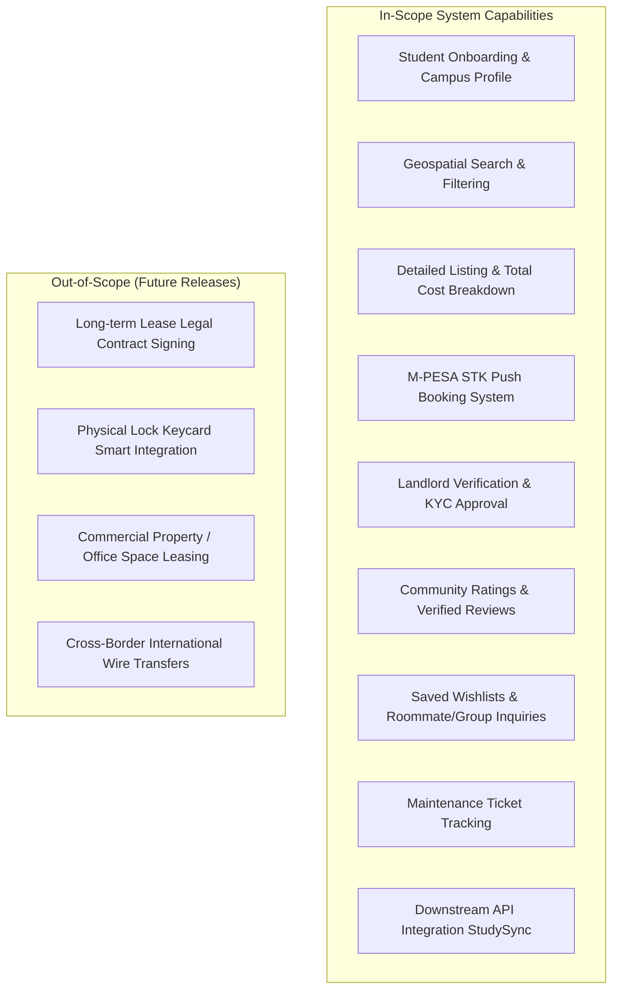
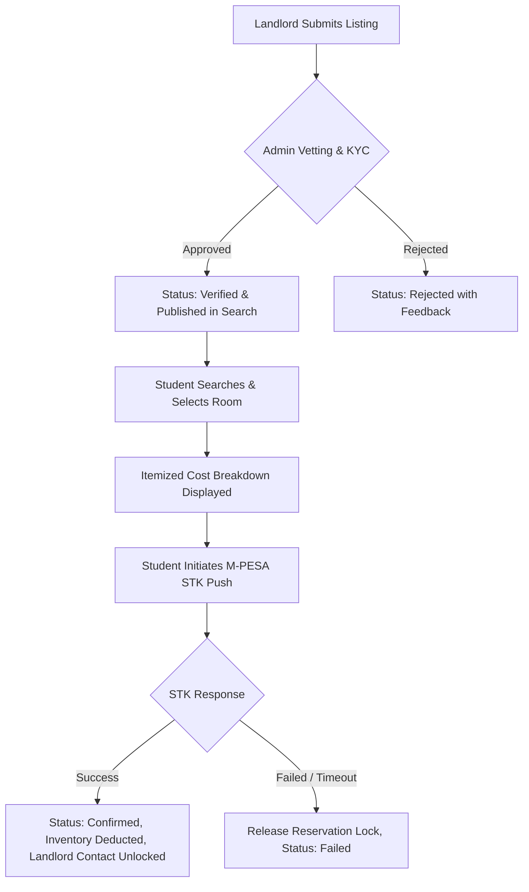

# CUSTOMER REQUIREMENT SPECIFICATION (CRS)
## Project Name: SettleIn — Student Housing & Accommodation Marketplace
**Document Version:** 1.0  
**Prepared By:** Product & Business Analyst Team  
**Institution:** Strathmore University  
**Target Platform:** Web & Mobile Responsive Application  
**Date:** September 2026  

---

## 1. Document Overview & Purpose

### 1.1 Purpose
This **Customer Requirement Specification (CRS)** document captures the business needs, user expectations, functional capabilities, and operational constraints for the **SettleIn** Student Housing Marketplace platform. It translates stakeholder interviews, student pain points, and property management challenges into a clear, structured blueprint to guide the development and validation of the software.

### 1.2 Document Scope
This document specifies the software requirements from the customer and business perspective. It serves as a contractual agreement between end-users (students, landlords, university administrators) and the engineering team.

---

## 2. Business Context & Problem Statement

### 2.1 Current Situation (The "As-Is" Problem)
Finding off-campus student accommodation near Kenyan universities (e.g., Strathmore University, University of Nairobi, Kenyatta University, JKUAT) is currently broken, informal, and risky:
1. **Rampant Scams & Fraud**: Fake agents demand non-refundable "viewing fees" or advance deposits for non-existent or mischaracterized rooms.
2. **Hidden & Ambiguous Costs**: Listings fail to disclose water bills, Wi-Fi fees, garbage collection costs, and security deposits upfront, causing unexpected financial strain.
3. **Physical & Logistical Fatigue**: Students and parents must physically walk around unfamiliar estates (e.g., Madaraka, Nairobi West, Parklands, Juja) for days to locate vacancies.
4. **Lack of Trustworthy Peer Feedback**: No centralized, objective platform exists for students to view honest reviews regarding Wi-Fi reliability, landlord responsiveness, security, or water availability.
5. **Inefficient Landlord Operations**: Honest property managers rely on roadside flyers, word-of-mouth, or unstructured WhatsApp groups, leading to high vacancy rates and manual booking headaches.

### 2.2 Proposed Solution (The "To-Be" State)
**SettleIn** is a centralized, digital student housing marketplace that connects university students directly with verified property managers. The platform eliminates middleman exploitation by providing verified listings, spatial proximity to campus gates, transparent cost breakdowns, direct M-PESA reservation payments, and student community ratings.

### 2.3 Business Goals & Success Metrics (KPIs)
* **Trust & Safety**: 100% of public listings verified via landlord KYC and property inspection before publishing.
* **Search Efficiency**: Reduce average student search-to-booking time from 7 days to under 15 minutes.
* **Cost Transparency**: Zero undisclosed fees; 100% breakdown of rent, deposit, and utility inclusions presented before reservation.
* **Booking Conversion**: Seamless self-service reservation powered by instant mobile money (M-PESA Daraja STK push).
* **Cross-Platform Interoperability**: Expose secure REST APIs to partner student platforms (e.g., StudySync) for residential proximity and group study venue matching.

---

## 3. Stakeholder & Persona Analysis

| Persona / Stakeholder | Description & Demographics | Core Needs & Objectives | Key Pain Points |
| :--- | :--- | :--- | :--- |
| **Primary Customer: University Student (Tenant)** | 18–26 years old; undergraduate/postgraduate students; digitally savvy; budgeting carefully. | • Find affordable, secure housing within walking distance of campus. • View transparent pricing (rent + deposit + utilities). • Reserve instantly without paying rogue broker fees. | • Fake listings & financial scams. • Unreliable utilities (water/Wi-Fi outages). • Distance/commute uncertainty. |
| **Secondary Customer: Landlord / Property Manager** | Property owners, caretakers, and real estate managers operating student hostels and apartments. | • Reach verified university students quickly. • Minimize vacant room turnaround time. • Manage bookings and digital payments smoothly. | • Time wasted answering non-serious inquiries. • Rent defaults and delayed reservation confirmations. • Lack of digital marketing tools. |
| **Tertiary Stakeholder: University Administration** | Student Affairs / Dean of Students / Off-Campus Housing Office. | • Ensure off-campus student security and quality of living. • Access aggregate housing safety and proximity metrics. | • Student welfare complaints. • Security incidents in unaccredited hostels. |
| **Platform Administrator / QA Team** | SettleIn operations and support staff. | • Review landlord verification documents (KYC). • Moderate reviews and handle dispute resolutions. • Maintain platform uptime and listing integrity. | • Fraudulent submissions and manual audit bottlenecks. |
| **Downstream Partner Platform (StudySync)** | Inter-university student collaboration system. | • Query student residential area, study amenities, and lease timelines to coordinate study sprints. | • Privacy leaks or inconsistent data contracts. |

---

## 4. Scope of the System

---

## 5. Customer Functional Requirements (User Stories & Capabilities)

### Module 1: User Account & Identity Management (CRS-FR-01)
* **CRS-FR-01.1**: The system **shall** allow users to register and authenticate as either a **Student** or a **Landlord**.
* **CRS-FR-01.2**: The system **shall** allow students to select their university affiliation (e.g., Strathmore University, UoN, KU, JKUAT) and specify their campus branch.
* **CRS-FR-01.3**: The system **shall** allow students to upload student identification for verified student badge issuance.
* **CRS-FR-01.4**: The system **shall** support secure session management, password resets via OTP/email, and profile customization (display name, avatar, contact number).

### Module 2: Smart Search & Campus Proximity Discovery (CRS-FR-02)
* **CRS-FR-02.1**: The system **shall** provide an intuitive search interface allowing students to filter properties by:
  * Nearest University Campus and specific campus gates.
  * Room Type: *Bedsitter, Studio, Hostel Room, Shared Apartment, 1-Bedroom, 2-Bedroom*.
  * Maximum Budget / Monthly Rent Range (KES).
  * Distance to Campus (e.g., `< 500m`, `500m – 1.5km`, `1.5km – 3km`, `> 3km`).
  * Gender Preference Policy: *Mixed, Female-Only, Male-Only*.
  * Furnishing Status: *Furnished, Semi-Furnished, Unfurnished*.
  * Utility Inclusions: *Water included, Wi-Fi included, Electricity included, Garbage included*.
* **CRS-FR-02.2**: The system **shall** support instant full-text search across estate names (e.g., *Madaraka, Nairobi West, Ngara, Parklands, Juja, Kahawa Sukari*).
* **CRS-FR-02.3**: The system **shall** visually highlight listings verified with the official **"Verified"** trust badge.

### Module 3: Property Profiles & Transparent Cost Breakdown (CRS-FR-03)
* **CRS-FR-03.1**: The system **shall** display comprehensive property details, including high-resolution photo galleries, room descriptions, security features (e.g., CCTV, biometric gate, 24/7 guard), and house rules (e.g., curfew, visitor policy).
* **CRS-FR-03.2**: The system **shall** provide an itemized **Total Cost of Move-In Breakdown** prior to booking:
  * Base Monthly Rent (KES)
  * Refundable Security Deposit (KES)
  * Platform Booking Fee / Reservation Commitment (KES)
  * Included vs. Excluded Utility checklist.
* **CRS-FR-03.3**: The system **shall** calculate and display the walking and driving commute time from the property to the main university entrance.
* **CRS-FR-03.4**: The system **shall** dynamically display real-time unit availability and trigger scarcity warnings (e.g., *"Only 1 room left!"*).

### Module 4: Secure Reservation & M-PESA Booking Integration (CRS-FR-04)
* **CRS-FR-04.1**: The system **shall** allow an authenticated student to initiate a room reservation by selecting a move-in date and lease duration.
* **CRS-FR-04.2**: The system **shall** initiate a simulated or live **M-PESA STK Push** payment prompt directly to the student's registered mobile number.
* **CRS-FR-04.3**: The system **shall** temporarily hold/lock the selected unit inventory for 5 minutes during the checkout transaction to prevent double bookings.
* **CRS-FR-04.4**: Upon successful payment, the system **shall** instantly update the booking status to `Confirmed`, deduct available inventory, generate a downloadable PDF/digital receipt, and unlock the landlord's direct WhatsApp and phone contact.
* **CRS-FR-04.5**: If payment fails or times out, the system **shall** release the reservation lock and inform the student with a clear failure explanation.

### Module 5: Landlord Property Portal & Listing Management (CRS-FR-05)
* **CRS-FR-05.1**: The system **shall** provide landlords with a self-service management dashboard displaying active listings, pending verification requests, inquiry messages, and occupant tallies.
* **CRS-FR-05.2**: The system **shall** provide a multi-step listing wizard allowing landlords to submit property details, upload photos, set room prices, define utility inclusions, and specify house rules.
* **CRS-FR-05.3**: The system **shall** allow landlords to quickly adjust unit availability (toggle units between *Available, Reserved, Occupied, Under Maintenance*).
* **CRS-FR-05.4**: The system **shall** allow landlords to review incoming student booking requests and confirm move-in schedules.

### Module 6: Trust, KYC & Fraud Prevention (CRS-FR-06)
* **CRS-FR-06.1**: All newly created landlord listings **shall** default to a `Pending Verification` state and remain hidden from public search until vetted by an administrator.
* **CRS-FR-06.2**: The system **shall** require landlords to submit identity proof (National ID / Passport) and property ownership or lease agreement documentation.
* **CRS-FR-06.3**: Administrators **shall** have an audit portal to inspect submitted documentation, approve listings with a verified badge, or reject listings with actionable feedback.
* **CRS-FR-06.4**: Students **shall** be able to flag/report suspicious or inaccurate listings directly to administrators for investigation.

### Module 7: Student Community Reviews & Ratings (CRS-FR-07)
* **CRS-FR-07.1**: The system **shall** allow verified student tenants to rate properties on a 1-to-5 star scale and write qualitative testimonials.
* **CRS-FR-07.2**: The system **shall** collect sub-ratings for critical student factors: *Wi-Fi Reliability, Water Availability, Cleanliness, Security, and Landlord Responsiveness*.
* **CRS-FR-07.3**: The system **shall** display a **"Verified Tenant"** badge on reviews submitted by students with a confirmed platform booking.
* **CRS-FR-07.4**: Landlords **shall** have the ability to post a public response to reviews on their property.

### Module 8: Wishlists, Comparison & Group Inquiries (CRS-FR-08)
* **CRS-FR-08.1**: The system **shall** allow students to bookmark properties into personal wishlists.
* **CRS-FR-08.2**: The system **shall** allow students to compare up to 3 saved properties side-by-side (comparing rent, distance to campus, amenities, and ratings).
* **CRS-FR-08.3**: The system **shall** support group accommodation inquiries, allowing multiple students to submit a joint request for multi-bedroom apartments.

### Module 9: In-App Maintenance Ticketing (CRS-FR-09)
* **CRS-FR-09.1**: Confirmed student tenants **shall** be able to submit maintenance requests (e.g., Plumbing, Electrical, Wi-Fi outage) with photo evidence and urgency level.
* **CRS-FR-09.2**: Landlords **shall** be notified of new maintenance tickets and be able to update progress (*Submitted -> Acknowledged -> In Progress -> Resolved*).

### Module 10: Inter-System Partner Integration (CRS-FR-10)
* **CRS-FR-10.1**: The system **shall** expose secure REST APIs to authorized downstream partners (e.g., StudySync) to provide:
  * Student residential neighborhood and distance to campus (for study group midpoint calculation).
  * Accommodation study amenities (Wi-Fi speed, study desk, backup generator).
  * Move-in and lease timeline dates (for availability calendar sync).
  * Verified student profile confirmation.
* **CRS-FR-10.2**: All partner API integrations **shall** enforce strict role-based access control (RBAC), omitting private student phone numbers, password hashes, and financial records.

---

## 6. Non-Functional Requirements (Quality Attributes)

### 6.1 Usability & Human Factors
* **NFR-U01 (Mobile Responsiveness)**: The application UI must be fully responsive across mobile phones (360px+), tablets, and desktop displays.
* **NFR-U02 (Theme Modes)**: The system shall support both Dark and Light visual themes with smooth contrast compliance (WCAG 2.1 AA standard).
* **NFR-U03 (Intuitiveness)**: A first-time student user shall be able to search and initiate a room reservation in under 3 minutes without user manual assistance.

### 6.2 Performance & Efficiency
* **NFR-P01 (Page Load Time)**: Initial page load must render in under 1.5 seconds on standard 4G mobile networks.
* **NFR-P02 (Search Latency)**: Filter and search queries across thousands of accommodations must execute in under 300 milliseconds.
* **NFR-P03 (STK Push Dispatch)**: Payment checkout requests must trigger the M-PESA STK prompt on the user's phone within 3 seconds of initiation.

### 6.3 Security & Privacy
* **NFR-S01 (Authentication & Authorization)**: Passwords must be hashed using industry-standard hashing algorithms (e.g., bcrypt/argon2). API routes must be protected using JWT tokens.
* **NFR-S02 (Contact Masking)**: Landlord direct phone numbers and WhatsApp links must remain masked and protected from scraping until a booking is verified or initiated.
* **NFR-S03 (Data Protection Compliance)**: Student personal data must comply with the Kenya Data Protection Act (2019). No plain-text storage of payment PINs or national identity numbers.

### 6.4 Reliability, Availability & Concurrency
* **NFR-R01 (Uptime)**: The platform shall target 99.9% availability during peak university intake seasons (January, May, September).
* **NFR-R02 (Concurrency & Inventory Integrity)**: The system must enforce strict transactional locking to guarantee that a room cannot be double-booked by two students at the same instant.

### 6.5 Maintainability & Extensibility
* **NFR-M01 (Modular Design)**: Frontend components and backend services must follow clean architectural separation (feature-based modularity).
* **NFR-M02 (API Standards)**: All inter-service communications must adhere to RESTful naming conventions and OpenAPI 3.0 specifications.

---

## 7. Business Rules & Operational Constraints

1. **Rule 1 (Verification Gate)**: No property listing shall be visible to students in public search results without explicit Admin verification (`status = 'verified'`).
2. **Rule 2 (Anti-Scam Contact Blur)**: Landlord personal contacts are masked by default. Only students with an active reservation or confirmed booking may access direct contact info.
3. **Rule 3 (Pricing Integrity)**: The total move-in cost must be transparently displayed as:  
   $$\text{Total Upfront} = \text{Monthly Rent} + \text{Security Deposit} + \text{Booking Fee}$$
4. **Rule 4 (Inventory Decrement)**: Upon successful payment webhook confirmation, the property's vacant unit count must decrement by 1 immediately. When count reaches 0, the status automatically switches to `Sold Out`.
5. **Rule 5 (Review Authenticity)**: Only authenticated students who have completed a booking or verified tenancy at a property are permitted to award star ratings and reviews.

---

## 8. Assumptions & Dependencies

### 8.1 Technical Dependencies
* **Safaricom Daraja API**: For real-time M-PESA STK Push, transaction queries, and C2B payment callbacks.
* **Map & Geolocation Services**: Google Maps / OpenStreetMap APIs for distance matrix and walking time computations to university gates.
* **Cloud Storage & CDN**: For hosting verified property photos, landlord KYC documents, and student avatar images.

### 8.2 User & Operational Assumptions
* Students possess an internet-enabled mobile device or laptop and an active M-PESA registered phone line.
* Landlords have access to basic smartphone photography to document property interiors and exterior security gates.
* University campuses have fixed, identifiable GPS coordinates for their main entrances.

---

## 9. Customer Acceptance Criteria & Sign-off Checklist

| Requirement ID | Acceptance Test Scenario | Expected Outcome | Pass/Fail Criteria |
| :--- | :--- | :--- | :--- |
| **UAC-01** | Student searches for "Bedsitter" under KES 12,000 within 1km of Strathmore University. | Returns only verified listings matching exact filter criteria with correct walking distances. | Pass if zero unrelated or out-of-budget listings appear. |
| **UAC-02** | Student opens property profile page. | Transparent breakdown of Rent, Deposit, Booking Fee, and Included Utilities is clearly visible. | Pass if all cost components sum up accurately. |
| **UAC-03** | Student clicks "Book via M-PESA" and enters mobile number. | STK push pop-up appears on handset; successful PIN entry updates booking to `Confirmed` and reveals Landlord contact. | Pass if booking receipt is generated and unit count decrements. |
| **UAC-04** | Landlord creates and submits a new property listing. | Property enters `Pending` state, is excluded from public search, and appears on Admin review queue. | Pass if listing only goes live after Admin approval. |
| **UAC-05** | Downstream system (StudySync) queries `/api/v1/users/{id}/residence-area`. | Returns neighborhood and campus distance; redacts phone number and exact unit room number. | Pass if student privacy boundaries are strictly respected. |

---

## 10. Document Approval & Sign-Off

| Stakeholder Role | Representative Name | Approval Status | Signature / Date |
| :--- | :--- | :--- | :--- |
| **API & Architecture Lead** | Githaka, Gift Gicheru (193923) | Approved | *01/09/2026* |
| **Backend & Data Lead** | Abdi, Yahya Ahmed (220982) | Approved | *01/09/2026* |
| **DevOps & Documentation Lead** | Olale, Tiffany Akello (221126) | Approved | *01/09/2026* |
| **Integration & QA Lead** | Kungu, Ian Gachigua (220259) | Approved | *01/09/2026* |
