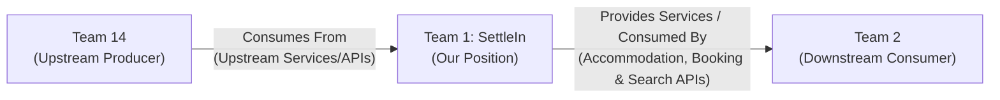

# TEAM CHARTER — SettleIn (Team 1)

---

## 1. Team Information & Role Distribution

* **Team / Project Name:** SettleIn (Team 1)
* **Application Domain:** Student Housing & Accommodation Marketplace

### Team Roster & Assigned Roles

| Admission No. | Full Name | Starting Role | Core Responsibilities & Deliverables |
| :--- | :--- | :--- | :--- |
| **193923** | **Githaka, Gift Gicheru** | **API Lead** | Define API architecture and contract standards (REST / OpenAPI specification); design resource URI schemas and response payloads; establish error handling guidelines; coordinate frontend-backend contracts and role-based access rules. |
| **220982** | **Abdi, Yahya Ahmed** | **Backend Dev (Endpoints & Database Logic)** | Implement server routes, controllers, and business logic; create database schemas and migrations; build querying/filtering pipelines; implement payment integrations (M-PESA Daraja STK Push & webhooks) and security sanitization. |
| **221126** | **Olale, Tiffany Akello** | **Docs / DevOps Lead** | Author and maintain interactive API documentation (Swagger/OpenAPI UI & Postman collections); configure CI/CD automation pipelines (GitHub Actions); manage environment variables and secrets; lead deployment and server hosting infrastructure. |
| **220259** | **Kungu, Ian Gachigua** | **Integration / QA Lead** | Integrate live backend APIs with the React frontend client; write automated unit, integration, and E2E test suites; test boundary cases, rate limits, and security vulnerabilities; manage bug tracking, QA verification, and cross-device validation. |

---

## 2. Application Overview (Existing App Summary)

**SettleIn** is a comprehensive, student-centric accommodation marketplace designed to eliminate the friction, opacity, and scam risks students face when searching for off-campus housing near universities in Kenya (such as Strathmore University, University of Nairobi, Kenyatta University, and JKUAT). The platform provides university students (tenants) with verified room listings—ranging from bedsitters and studios to shared hostel rooms—complete with transparent upfront cost breakdowns, distance-to-campus calculations, utility inclusions, and simulated M-PESA booking payments. Concurrently, it empowers verified property managers (landlords) with a dedicated management portal to list properties, manage vacant inventory, and receive verified student booking requests under an administrative verification umbrella.

---

## 3. Full Entity & Action Inventory (API Resources & Operations)

Every entity ("Thing") that SettleIn stores, alongside all operations and actions available to students, landlords, and administrators:

### 1. User Accounts & Profiles (`users`)
* **Data Stored:** User ID, full name, email address, password hash, phone number, role (`student`, `landlord`, `admin`), university affiliation, student ID number, avatar URL, verification status, created timestamp, last active timestamp.
* **Actions Available:**
  * `create_user` (Register as student or landlord)
  * `get_profile` (View own authenticated profile)
  * `get_landlord_profile` (View public landlord profile and rating history)
  * `update_profile` (Edit name, phone number, university, avatar)
  * `change_password` / `reset_password`
  * `deactivate_account` / `delete_account`
  * `verify_student_id` (Upload student ID card for verification)
  * `admin_list_users` / `admin_filter_users`
  * `admin_suspend_user` / `admin_reinstate_user`

### 2. Authentication Sessions (`sessions` / `auth`)
* **Data Stored:** Session ID, user ID, JWT token / refresh token, client IP address, user agent, expiration timestamp, active status.
* **Actions Available:**
  * `login` (Authenticate credentials and issue tokens)
  * `logout` (Invalidate current session)
  * `logout_all_devices` (Revoke all active refresh tokens)
  * `refresh_token` (Generate fresh access token)
  * `request_password_reset_otp`
  * `verify_password_reset_otp`

### 3. Properties & Accommodations (`properties` / `listings`)
* **Data Stored:** Property ID, title, description, property type (`Bedsitter`, `Hostel Room`, `Shared Apartment`, `Studio`, `1-Bedroom`, `2-Bedroom`), base monthly rent, security deposit amount, booking fee, physical address/location, latitude & longitude, nearest campus ID, distance to campus (km/walking time), gender policy (`Mixed`, `Female-only`, `Male-only`), furnishing status (`Furnished`, `Unfurnished`, `Semi-furnished`), total units, vacant units count, utility flags (`water_included`, `wifi_included`, `garbage_included`, `electricity_included`), landlord ID, verification status (`verified`, `pending`, `rejected`), house rules, listing status (`published`, `draft`, `archived`).
* **Actions Available:**
  * `create_property` (Submit new accommodation listing)
  * `get_property_detail` (View full property profile and pricing breakdown)
  * `list_properties` (Browse all listings with pagination and sorting by price/distance/rating)
  * `search_properties` (Full-text search by title, estate name, or keyword)
  * `filter_properties` (Filter by campus, max budget, room type, gender policy, furnishing, utilities, verified badge)
  * `update_property` (Edit property details and house rules)
  * `update_vacancy` (Adjust vacant unit count / toggle sold-out status)
  * `archive_property` / `unpublish_property`
  * `delete_property`
  * `admin_verify_property` (Approve listing and assign Verified badge)
  * `admin_reject_property` (Reject listing with feedback notes)
  * `report_property` (Flag fraudulent or inaccurate listing)

### 4. Individual Units / Rooms (`units` / `rooms`)
* **Data Stored:** Unit ID, property ID, unit/room number, floor level, specific price, room capacity (single, double, quad), occupancy status (`available`, `reserved`, `occupied`, `maintenance`), unit amenities.
* **Actions Available:**
  * `create_unit` / `bulk_create_units`
  * `get_unit_detail`
  * `update_unit` (Update pricing or amenities)
  * `set_unit_status` (Mark Occupied / Reserved / Available / Maintenance)
  * `delete_unit`

### 5. Property Media & Virtual Tours (`media`)
* **Data Stored:** Media ID, property ID / unit ID, file URL, thumbnail URL, media type (`image`, `video`, `floorplan`, `virtual_tour_360`), caption tag, sort index, upload timestamp.
* **Actions Available:**
  * `upload_media` (Upload photos and video tour links)
  * `get_property_gallery` (View full-resolution images and videos)
  * `set_primary_cover_image`
  * `update_media_caption`
  * `delete_media`

### 6. Universities & Campuses (`campuses`)
* **Data Stored:** Campus ID, institution name, branch name, GPS coordinates (latitude, longitude), perimeter radius, main entrance gate coordinates, city/county.
* **Actions Available:**
  * `list_campuses` (Retrieve list of supported campuses: Strathmore, UoN, KU, JKUAT, etc.)
  * `get_campus_detail` (View campus boundaries and gate coordinates)
  * `calculate_commute` (Compute distance and walking time from property to campus gates)
  * `admin_create_campus` / `admin_update_campus` / `admin_delete_campus`

### 7. Amenities & Utilities (`amenities`)
* **Data Stored:** Amenity ID, name, icon slug/SVG, category (`security`, `utilities`, `comfort`, `study`), description.
* **Actions Available:**
  * `list_amenities` (Fetch all standardized amenity tags)
  * `filter_by_amenities` (Filter accommodations by required amenities)
  * `attach_amenity_to_property` / `detach_amenity_from_property`
  * `admin_create_amenity`

### 8. Bookings & Room Reservations (`bookings`)
* **Data Stored:** Booking ID, property ID, unit ID, student ID, landlord ID, booking date, proposed move-in date, lease duration (semesters/months), booking fee, deposit amount, total initial payment, status (`pending_payment`, `confirmed`, `rejected_by_landlord`, `cancelled_by_student`, `completed`, `expired`), special requests.
* **Actions Available:**
  * `create_booking` (Initiate room reservation request)
  * `get_booking_detail` (View reservation status and receipt)
  * `list_student_bookings` (View student's booking history)
  * `list_landlord_bookings` (View incoming tenant booking requests)
  * `confirm_booking` (Landlord accepts booking)
  * `reject_booking` (Landlord declines with reason)
  * `cancel_booking` (Student/Landlord cancels reservation)
  * `complete_booking` (Mark student moved in)
  * `download_booking_receipt` (Generate PDF confirmation)

### 9. Payments & Transactions (`payments` / `transactions`)
* **Data Stored:** Transaction ID, booking ID, student ID, payee ID, payment method (`mpesa_stk`, `card`, `bank`), amount (KES), currency, M-PESA checkout request ID, M-PESA receipt number, phone number, status (`initiated`, `pending_pin`, `success`, `failed`, `reversed`, `refunded`), timestamp, failure reason.
* **Actions Available:**
  * `initiate_mpesa_stk` (Trigger M-PESA push to user's phone)
  * `check_transaction_status` (Query/poll STK push status)
  * `handle_mpesa_callback` (Process incoming Daraja webhook confirmation)
  * `get_payment_receipt`
  * `list_user_transactions`
  * `request_refund` (Dispute transaction or request booking fee refund)
  * `process_refund` (Admin/Landlord executes refund)
  * `export_earnings_report` (Generate financial summary for landlord)

### 10. Landlord Contact Access (`contact_unlocks`)
* **Data Stored:** Unlock ID, student ID, landlord ID, property ID, trigger reason (`confirmed_booking`, `admin_override`), unlocked timestamp, expiry.
* **Actions Available:**
  * `unlock_landlord_contact` (Reveal unblurred phone and WhatsApp number)
  * `check_contact_permission` (Verify if student has unlocked access)
  * `launch_whatsapp_chat` / `launch_phone_call`

### 11. Reviews & Community Ratings (`reviews`)
* **Data Stored:** Review ID, property ID, student ID, reviewer display name, star rating (1–5), written review, sub-scores (cleanliness, security, Wi-Fi, responsiveness), verified tenant badge, timestamp, status (`published`, `flagged`, `hidden`).
* **Actions Available:**
  * `create_review` (Submit star rating and testimonial)
  * `list_property_reviews` (View all student reviews for a property)
  * `filter_reviews_by_stars`
  * `edit_review` (Update written review)
  * `delete_review`
  * `landlord_reply_to_review` (Landlord posts public response)
  * `upvote_review` (Mark review as helpful)
  * `report_review` (Flag offensive or fraudulent review)
  * `admin_moderate_review` (Hide or remove review)

### 12. Saved Listings / Wishlists (`saved_properties` / `bookmarks`)
* **Data Stored:** Save ID, student ID, property ID, collection/folder name, custom notes, saved timestamp.
* **Actions Available:**
  * `save_property` (Bookmark listing)
  * `unsave_property` (Remove bookmark)
  * `list_saved_properties` (View user's wishlist)
  * `create_wishlist_folder` (Organize by category)
  * `compare_saved_properties` (Side-by-side comparison of rent, distance, utilities, and amenities)
  * `share_wishlist` (Generate shareable link)

### 13. Messages & Inquiries (`inquiries` / `messages`)
* **Data Stored:** Message ID, conversation ID, property ID, sender ID, recipient ID, message text, attachment URL, read status, timestamp.
* **Actions Available:**
  * `start_inquiry` (Initiate discussion with landlord about a property)
  * `send_message`
  * `send_attachment` (Send ID proof or lease questions)
  * `get_conversation_history`
  * `mark_as_read`
  * `archive_conversation` / `delete_conversation`
  * `block_user`

### 14. Roommate Finder Profiles & Matching (`roommate_profiles` / `matches`)
* **Data Stored:** Profile ID, student ID, year of study, major/course, budget range, campus preference, gender preference, lifestyle habits (sleep schedule, cleanliness, study habits, noise tolerance), bio, status (`active_seeking`, `found_roommate`, `inactive`).
* **Actions Available:**
  * `create_roommate_profile`
  * `get_roommate_profile`
  * `update_roommate_profile`
  * `search_compatible_roommates` (Filter by campus, budget, study habits)
  * `send_roommate_request`
  * `accept_roommate_request` / `decline_roommate_request`
  * `deactivate_roommate_profile`

### 15. Landlord Verification & KYC Submissions (`verifications` / `kyc`)
* **Data Stored:** Verification ID, landlord ID, property ID, national ID/passport document URL, property ownership/lease proof document URL, status (`pending`, `under_review`, `approved`, `rejected`), reviewer ID, review notes / rejection reason, timestamp.
* **Actions Available:**
  * `submit_verification_documents` (Landlord uploads KYC documents)
  * `get_verification_status`
  * `resubmit_verification` (Upload corrections after rejection)
  * `admin_list_pending_verifications`
  * `admin_inspect_documents`
  * `admin_approve_verification` (Grant Verified badge)
  * `admin_reject_verification` (Provide detailed rejection reason)

### 16. Maintenance & Repair Requests (`maintenance_requests`)
* **Data Stored:** Ticket ID, property ID, unit ID, student ID, landlord ID, category (`plumbing`, `electrical`, `wifi`, `security`), urgency (`low`, `medium`, `emergency`), description, evidence photo URLs, status (`submitted`, `acknowledged`, `in_progress`, `resolved`, `closed`), resolution notes.
* **Actions Available:**
  * `create_maintenance_ticket`
  * `get_ticket_detail`
  * `list_property_maintenance_tickets` (Landlord view)
  * `update_ticket_status` (Landlord marks in-progress/resolved)
  * `add_ticket_comment`
  * `close_ticket` (Tenant confirms issue is fixed)

### 17. Notifications & Alerts (`notifications`)
* **Data Stored:** Notification ID, user ID, title, body, type (`booking_update`, `payment_success`, `new_message`, `price_drop`, `unit_alert`, `verification_approved`), target URL, read status (`read`, `unread`), timestamp.
* **Actions Available:**
  * `list_notifications`
  * `get_unread_count`
  * `mark_notification_read`
  * `mark_all_read`
  * `delete_notification`
  * `update_notification_preferences`

### 18. Search History & Saved Alerts (`search_alerts`)
* **Data Stored:** Alert ID, student ID, search criteria (campus, max price, room type, amenities), notification frequency, active status, timestamp.
* **Actions Available:**
  * `save_search_as_alert`
  * `list_saved_alerts`
  * `update_alert`
  * `toggle_alert_status`
  * `delete_alert`
  * `clear_search_history`

### 19. Support & Contact Inquiries (`support_tickets` / `contacts`)
* **Data Stored:** Ticket ID, sender name, email, phone, category (`general`, `support`, `landlord_inquiry`, `dispute`), message body, status (`open`, `in_review`, `resolved`), admin response, timestamp.
* **Actions Available:**
  * `submit_support_ticket`
  * `get_support_ticket_status`
  * `admin_list_support_tickets`
  * `admin_assign_ticket`
  * `admin_respond_ticket`
  * `admin_close_ticket`

---

## 4. Ring Position & Inter-Service Integration Topology

### Team 1 Position Details
* **Assigned Ring Position:** **Team 1**
* **Upstream Integration (Who we consume from):**
  * **Consuming from Team 14:** Team 1 consumes upstream data feeds, partner services, and shared integration endpoints provided by Team 14.
* **Downstream Integration (Who will consume us):**
  * **Consumed by Team 2:** Team 1 exposes student accommodation search, real-time vacant room availability, landlord verification statuses, and housing booking contract endpoints for direct consumption by Team 2.

Link for github : https://github.com/Gift10477/settlein-student-housing
